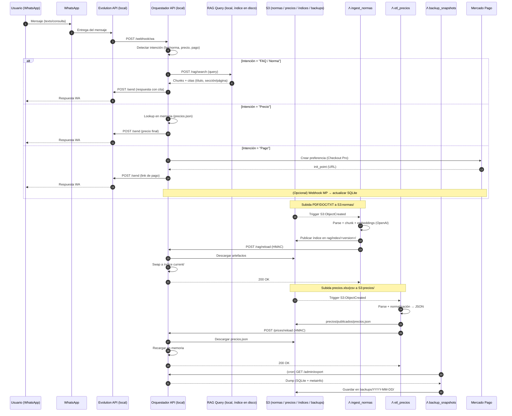

# README — WhatsApp + Orquestador Local + S3 + Lambdas (sin DB administrada)

Este proyecto define una arquitectura **híbrida** donde **AWS** sólo se usa para **S3 + AWS Lambda** (ingesta RAG, ETL de precios y backups), mientras que el **runtime conversacional** vive **en tu PC** (Docker): **Evolution API (WhatsApp)**, **Orquestador API**, **RAG Query** (FAISS/Chroma en disco) y **SQLite** para estado mínimo.

> **Objetivo:** responder mensajes de WhatsApp con: (1) FAQ/NORMAS vía RAG pequeño, (2) consulta de **precios** desde archivo, y (3) link de pago (Mercado Pago). Mantener costos ≈ \$0.

---

## 1) Arquitectura (alto nivel)

```
AWS
 ├─ S3
 │   ├─ normas/                      # PDFs/DOC/TXT fuente
 │   ├─ rag/index/<version>/         # artefactos del índice RAG
 │   ├─ precios/precios.{csv|xlsx}   # fuente de precios
 │   ├─ precios/publicados/          # precios.json normalizado (runtime)
 │   └─ backups/YYYY-MM-DD/          # dumps (SQLite + índice + logs)
 ├─ Lambda ingest_normas (S3:normas/*) → embeddings + publicación de índice RAG
 ├─ Lambda etl_precios  (S3:precios/*) → normalización a precios.json
 └─ Lambda backup_snapshots (cron)     → orquesta backups a S3

TU PC (Docker)
 ├─ Evolution API (WhatsApp)
 ├─ Orquestador API (webhook WA + admin + pagos)
 ├─ RAG Query Service (FAISS/Chroma en disco)
 └─ SQLite (conversaciones/pagos/logs)
```

**Conexión**: Las Lambdas notifican a tu Orquestador local mediante **callback HTTPS** (túnel seguro) y **firma HMAC**.

---

## 2) Componentes

- **S3**: repositorio de documentos de entrada/salida y backups, con **versioning** y **lifecycle**.
- **Lambda `ingest_normas`**: procesa PDFs/DOC/TXT → chunking → **OpenAI Embeddings** → artefactos de índice en `rag/index/<version>/` → callback `/rag/reload`.
- **Lambda `etl_precios`**: convierte CSV/XLSX a **JSON normalizado** → publica en `precios/publicados/precios.json` → callback `/prices/reload`.
- **Lambda `backup_snapshots`**: cron diario que asegura dump en `backups/YYYY-MM-DD/`.
- **Evolution API (local)**: conexión WhatsApp (Baileys u oficial).
- **Orquestador API (local)**: enruta intenciones, llama RAG/precios/pagos y responde por Evolution.
- **RAG Query (local)**: búsqueda vectorial sobre índice **en disco**.
- **SQLite (local)**: estado mínimo (conversaciones/pagos/logs).

---

## 3) Prerrequisitos

- **Cuenta AWS** con permisos para: S3, Lambda, SSM Parameter Store.
- **Docker** en tu PC.
- **Túnel HTTPS** (p. ej., **Cloudflare Tunnel** → `api-dev.tudominio.com`).
- **Claves**: OpenAI, Mercado Pago, Evolution (si aplica), **HMAC_SECRET**.

---

## 4) Variables de entorno (resumen)

**Orquestador**

- `S3_BUCKET`
- `S3_PREFIX_RAG=rag/index`
- `S3_PREFIX_PRECIOS=precios/publicados`
- `OPENAI_API_KEY` (si el orquestador también redacta)
- `HMAC_SECRET` (validación de callbacks)
- `EVOLUTION_BASE_URL`, `EVOLUTION_API_KEY` (si aplica)
- `MP_ACCESS_TOKEN` (Mercado Pago)

**RAG Query**

- `RAG_INDEX_DIR=/data/rag/index`
- `TOP_K` (opcional)

**Lambdas (SSM Parameter Store)**

- `/project/HMAC_SECRET`
- `/project/OPENAI_API_KEY`

---

## 5) Estructura S3

- `normas/` → archivos fuente (PDF/DOC/TXT)
- `rag/index/<version>/` → artefactos del índice (FAISS/Chroma shards + manifest)
- `precios/precios.xlsx|csv` → fuente de precios
- `precios/publicados/precios.json` → dataset para runtime
- `backups/YYYY-MM-DD/` → dumps diarios (zip de SQLite + índice + logs)

**Lifecycle sugerido**

- `backups/` → mover a Standard-IA a 30 días; expirar a 90 días.
- `rag/index/` → conservar **3 versiones**; expirar anteriores a 180 días.

---

## 6) Endpoints (contratos)

**Públicos (desde Evolution / Mercado Pago / Lambdas)**

- `POST /webhook/wa` → evento entrante de WhatsApp (Evolution → Orquestador).
- `POST /payments/mp/webhook` → notificación de Mercado Pago (opcional hacerlo local).
- `POST /rag/reload` → **callback Lambda** (firma HMAC) → descarga/activa índice.
- `POST /prices/reload` → **callback Lambda** (firma HMAC) → recarga precios en memoria.

**Internos**

- `POST /integrations/evolution/send` → enviar respuesta por WhatsApp.
- `POST /rag/search` → búsqueda semántica; devuelve `chunks[]` y `citations[]`.
- `POST /payments/mp/preference` → crear preferencia (link de pago).
- `GET /admin/export` → export para backup.
- `GET /health` → chequeos (S3, Evolution, índice, disco, etc.).

**Seguridad de callbacks**

- Cabeceras: `X-Signature` (HMAC-SHA256) y `X-Timestamp` (epoch ms; ventana ±5 min).

---

## 7) Flujo de trabajo

### A) Actualizar NORMAS (RAG)

1. Subir un PDF/DOC/TXT a `s3://<bucket>/normas/`.
2. **Lambda `ingest_normas`** → chunking + embeddings (OpenAI) → publica índice en `rag/index/<version>/`.
3. **Callback** `POST /rag/reload` (con HMAC) → Orquestador descarga y “switchea” el índice local.

### B) Actualizar PRECIOS

1. Subir `precios.xlsx|csv` a `s3://<bucket>/precios/`.
2. **Lambda `etl_precios`** → publica `precios/publicados/precios.json`.
3. **Callback** `POST /prices/reload` (con HMAC) → Orquestador recarga a memoria.

### C) Conversación WhatsApp

1. Cliente escribe → **Evolution** envía a `POST /webhook/wa`.
2. Orquestador decide intención:

   - **RAG** → `POST /rag/search` → compone respuesta.
   - **Precios** → consulta en memoria (de `precios.json`).
   - **Pago** → `POST /payments/mp/preference` → devuelve link.

3. Orquestador responde vía `POST /integrations/evolution/send`.

### D) Backups

- **Lambda `backup_snapshots`** (cron) asegura .zip en `backups/YYYY-MM-DD/`.

---

## 8) Operación y monitoreo

- **/health**: lista S3 (prefijos), verifica índice local, ping a Evolution, espacio en disco.
- **Métricas mínimas**: mensajes/día, latencia media, pagos creados/aprobados (SQLite → export semanal a S3).
- **Logs**: rotación local; conservar 7–14 días en la máquina.

---

## 9) Costos

- **S3**: centavos/mes (documentos + índices + backups).
- **Lambda**: free tier/centavos (ingestas y cron).
- **API Gateway**: opcional (para callbacks); bajo costo en dev.
- **OpenAI**: se descuentan de tus créditos.

---

## 10) Roadmap sugerido

1. **Infra S3** (bucket con versioning + lifecycle) y SSM (HMAC/keys).
2. **Túnel HTTPS** activo (`api-dev.tudominio.com`).
3. **Lambdas**: `ingest_normas`, `etl_precios`, `backup_snapshots`.
4. **Servicios locales** en Docker: Evolution, Orquestador, RAG, SQLite.
5. **Callbacks firmados** implementados.
6. **Pruebas E2E** (normas, precios, conversación WA, pago) y **/health**.
7. **Backups diarios** verificados en `backups/`.

---

## 11) Troubleshooting

- **Callback falla (401/403)**: revisar `HMAC_SECRET`, drift de reloj (>5 min), URL del túnel.
- **Índice RAG no carga**: validar versión/manifest, permisos S3, espacio en disco.
- **Precios desactualizados**: re-subir fuente; revisar que `etl_precios` publique `precios.json`.
- **WhatsApp no responde**: chequear Evolution vivo, token, y conectividad a tu Orquestador.
- **Backups ausentes**: revisar cron de `backup_snapshots` o `/admin/export`.

---

## 12) Notas de seguridad

- Mantener claves en **SSM Parameter Store** (en Lambdas) y **.env local** seguro.
- Limitar exposición pública sólo a endpoints necesarios (webhooks/callbacks).
- Rotar tokens (Evolution/MP) y verificar retención de logs.

---

## 13) Licencia / Uso

Este README describe una arquitectura de referencia. Ajustá según requisitos del cliente y cumplimiento legal (especialmente para datos personales y condiciones de WhatsApp/Mercado Pago/OpenAI).

---

## 14) Plan de Pruebas E2E (con criterios de aceptación)

### A. RAG — Ingesta y Recarga

**Caso A1: Subida de norma nueva**

- **Dado** un `norma_seguridad.pdf` subido a `s3://<bucket>/normas/`.
- **Cuando** corre `ingest_normas` (chunk + embeddings + publica índice `rag/index/<version>` + callback HMAC a `/rag/reload`).
- **Entonces** el Orquestador descarga la versión, hace _swap_ a `rag/index/current/` y `/health` reporta la nueva versión.
- **Criterios**: HTTP 200 en callback; índice activo ≤ 60 s; consulta a `/rag/search` devuelve fragmentos de la nueva norma.

**Caso A2: Rollback de índice**

- **Dado** que el índice `v2` produce errores.
- **Cuando** ejecuto _rollback_ (activar `v1`).
- **Entonces** `current/` apunta a `v1` y `/rag/search` responde OK.
- **Criterios**: switch ≤ 30 s; sin 5xx; log del evento.

### B. Precios — ETL y Recarga

**Caso B1: Actualización de precios**

- **Dado** un `precios.xlsx` válido subido a `s3://<bucket>/precios/`.
- **Cuando** corre `etl_precios` (genera `precios/publicados/precios.json` + callback HMAC a `/prices/reload`).
- **Entonces** el Orquestador carga el JSON en memoria.
- **Criterios**: recarga ≤ 10 s; lookup por `sku` refleja nuevos valores.

**Caso B2: Archivo inválido**

- **Dado** un `precios.xlsx` con columnas faltantes.
- **Cuando** corre `etl_precios`.
- **Entonces** se rechaza la publicación y se notifica en logs/alerta.
- **Criterios**: no se actualiza `precios.json`; `/prices/lookup` mantiene valores previos.

### C. Conversación WhatsApp — Flujos

**Caso C1: FAQ (normas)**

- **Dado** un mensaje “¿Cuál es el horario de atención?”
- **Cuando** Evolution envía a `/webhook/wa`.
- **Entonces** Orquestador consulta `/rag/search` y responde con texto + cita.
- **Criterios**: respuesta ≤ 3 s; cita incluye `titulo` y (si aplica) `seccion`/página.

**Caso C2: Precio por SKU**

- **Dado** un mensaje “Precio SKU-AX100”.
- **Cuando** `/prices/lookup?sku=SKU-AX100` devuelve valores.
- **Entonces** Orquestador calcula `precio_final` y responde.
- **Criterios**: respuesta ≤ 2 s; formato ARS con separador local; si no existe, mensaje de no encontrado.

**Caso C3: Link de pago**

- **Dado** “Quiero comprar SKU-AX100”.
- **Cuando** `POST /payments/mp/preference` crea preferencia.
- **Entonces** se envía link de pago.
- **Criterios**: URL recibida; si Mercado Pago cae, mensaje de reintento.

**Caso C4: Confirmación de pago**

- **Dado** un pago aprobado.
- **Cuando** llega `/payments/mp/webhook` (o flujo equivalente) con `payment_id`.
- **Entonces** se marca `approved` en SQLite y se avisa al cliente.
- **Criterios**: idempotencia (múltiples notificaciones no duplican estado); log de auditoría.

### D. Seguridad / Resiliencia

**Caso D1: Callback sin firma**

- **Dado** un callback a `/rag/reload` sin `X-Signature`.
- **Entonces** HTTP 401/403.
- **Criterios**: registrar intento y _no_ cambiar índice.

**Caso D2: Timestamp fuera de ventana**

- **Dado** `X-Timestamp` con desfase > 5 min.
- **Entonces** HTTP 401/403.

**Caso D3: Caída de túnel**

- **Dado** el túnel inactivo.
- **Cuando** Lambda intenta callback.
- **Entonces** reintentos/alerta; al restablecer, posibilidad de _manual retry_.

### E. Rendimiento (mínimo viable)

- `/rag/search`: p50 ≤ 200 ms (índice local), p95 ≤ 800 ms con disco en buen estado.
- `/prices/lookup`: p50 ≤ 50 ms, p95 ≤ 200 ms.
- WhatsApp E2E (mensaje→respuesta): ≤ 3–5 s con OpenAI activo.

---

## 15) Datos de prueba

**Precios (CSV/Excel):**

- `SKU-AX100, Filtro HEPA AX100, purificadores, 12000, 0.21, 0.30, 0.05, ARS, 2025-09-15T12:00:00Z`
- `SKU-UV200, Lámpara UV 200, purificadores, 35000, 0.21, 0.25, 0.00, ARS, 2025-09-15T12:00:00Z`

**Norma PDF (contenido mínimo):**

- Título: "Política de Atención al Cliente"
- Sección: "Horarios" → "Lun-Vie 9–18 h, Sáb 9–13 h"

**Mensajes WA de ejemplo:**

- "¿Cuál es el horario de atención?"
- "Precio SKU-AX100"
- "Quiero comprar SKU-AX100"

---

## 16) Variables .env de ejemplo (local)

**Orquestador (.env)**

```
S3_BUCKET=tu-bucket
S3_PREFIX_RAG=rag/index
S3_PREFIX_PRECIOS=precios/publicados
OPENAI_API_KEY=sk-...
HMAC_SECRET=supersecreto123
EVOLUTION_BASE_URL=http://localhost:3001
EVOLUTION_API_KEY=...
MP_ACCESS_TOKEN=APP_USR-...
PORT=3000
```

**RAG Query (.env)**

```
RAG_INDEX_DIR=/data/rag/index
TOP_K=4
```

**Lambdas (SSM Parameter Store)**

```
/project/HMAC_SECRET=supersecreto123
/project/OPENAI_API_KEY=sk-...
```

---

## 17) Criterios de aceptación (resumen)

- RAG y precios se **recargan** automáticamente al subir fuentes a S3.
- Conversaciones WA responden con **citas** en normas y **precios** correctos.
- Se generan **links de pago** y se confirman pagos idempotentes.
- **Backups** diarios disponibles en `backups/`.
- **Callbacks** requieren HMAC válido y ventana de tiempo.
- `/health` refleja versión de índice, estado de túnel y acceso a S3.

---

## 18) Checklist por fases (AWS → WhatsApp → RAG → Backend)

### Fase A — AWS (S3 + Lambdas + SSM + opcional API GW)

- [ ] **S3**: crear bucket con _Versioning_ activo.
- [ ] **S3**: crear prefijos `normas/`, `rag/index/`, `precios/`, `precios/publicados/`, `backups/`.
- [ ] **S3 Lifecycle**: `backups/` → IA a 30d / expirar a 90d; `rag/index/` → conservar 3 versiones / expirar a 180d.
- [ ] **SSM Parameter Store**: guardar `/project/HMAC_SECRET`, `/project/OPENAI_API_KEY` (SecureString).
- [ ] **Lambda `ingest_normas`**: trigger S3 `normas/*`, memoria 1024–1536 MB, timeout 3–5 min, rol con S3+SSM.
- [ ] **Lambda `etl_precios`**: trigger S3 `precios/*`, memoria 512–1024 MB, timeout 1–2 min.
- [ ] **Lambda `backup_snapshots`**: EventBridge cron diario (03:00), rol S3.
- [ ] **Callbacks**: decidir si directo (Lambda → túnel) o via **API Gateway**; si API GW, crear endpoint y API key opcional.
- [ ] **Prueba rápida**: subir archivo dummy a `normas/` y verificar ejecución y logs en CloudWatch.

### Fase B — WhatsApp (Evolution local)

- [ ] **Docker**: preparar compose con Evolution.
- [ ] **Conexión**: modo Baileys (QR) u Oficial (Cloud API); validar envío/recepción básico.
- [ ] **Túnel HTTPS**: `api-dev.tudominio.com` hacia el Orquestador local.
- [ ] **Webhook**: configurar Evolution → `POST /webhook/wa` (tu PC).
- [ ] **Seguridad**: restringir puertos locales; .env protegido.
- [ ] **Smoke test**: enviar “hola” y recibir eco desde el Orquestador stub.

### Fase C — RAG (artefactos en S3, consulta local)

- [ ] **Documentos**: subir 1–3 PDFs de prueba a `normas/`.
- [ ] **Lambda ingest_normas**: verificar artefactos en `rag/index/<version>/` + manifest.
- [ ] **Callback `/rag/reload`**: validar firma HMAC y _swap_ a `current/`.
- [ ] **RAG Query local**: ejecutar búsqueda sobre índice `current/` (k=3–5).
- [ ] **Prueba funcional**: pregunta de norma desde WA y obtener respuesta con cita.

### Fase D — Backend (Orquestador + Precios + Pagos + Backups)

- [ ] **Precios**: subir `precios.xlsx|csv` → Lambda `etl_precios` → `precios/publicados/precios.json` → `POST /prices/reload`.
- [ ] **Lookups**: endpoint local `GET /prices/lookup` (memoria) responde correctamente.
- [ ] **Pagos**: `POST /payments/mp/preference` crea link de pago válido.
- [ ] **(Opcional) MP webhook**: configurar `POST /payments/mp/webhook` local y verificar idempotencia.
- [ ] **Backups**: `/admin/export` operativo y Lambda `backup_snapshots` sube a `backups/`.
- [ ] **/health**: muestra versión de índice, reach S3 y estado de Evolution.

---

## 19) Plan de trabajo (orden: AWS → WhatsApp → RAG → Backend)

### Día 1 — AWS base

1. Crear **bucket S3** con versioning y prefijos.
2. Configurar **Lifecycle** (backups e índices).
3. Cargar **SSM Parameters** (`HMAC_SECRET`, `OPENAI_API_KEY`).
4. Implementar **Lambda `ingest_normas`** (skeleton) y **`etl_precios`** (skeleton) con roles mínimos.
5. (Si aplica) Montar **API Gateway** para callbacks.
   **Salida esperada**: triggers listos, logs en CloudWatch, prueba de invocación ok.

### Día 2 — WhatsApp

1. Levantar **Evolution** en Docker (local) y vincular número (Baileys/Oficial).
2. Configurar **túnel** `api-dev.tudominio.com` → Orquestador stub.
3. Definir `POST /webhook/wa` y responder eco (stub) para validar ida/vuelta.
   **Salida esperada**: mensaje WA llega a tu endpoint y recibe respuesta.

### Día 3 — RAG (ingesta y consulta)

1. Subir **PDFs** a `normas/` → ejecutar **`ingest_normas`**.
2. Publicar artefactos en `rag/index/<version>/` + **callback** HMAC a `/rag/reload` (tu PC).
3. Confirmar **swap** de índice a `current/` y resolver búsquedas locales (RAG Query).
   **Salida esperada**: consultas RAG sirven fragmentos válidos con citas.

### Día 4 — Backend (precios + pagos + backups)

1. Subir `precios.xlsx|csv` → **`etl_precios`** → `precios.json` → `/prices/reload`.
2. Implementar **lookups** en memoria (`/prices/lookup`) y **cálculo** de `precio_final`.
3. Integrar **Mercado Pago**: `POST /payments/mp/preference` y prueba de link.
4. Habilitar `/admin/export` y programar **`backup_snapshots`** diario.
   **Salida esperada**: desde WA podés consultar normas, precios y recibir link de pago; backup diario aparece en S3.

### Día 5 — Endurecimiento y pruebas E2E

1. **/health** completo (S3, índice, Evolution, disco).
2. **Seguridad**: validar HMAC/timestamp, rotar tokens, revisar puertos.
3. **Pruebas E2E** (del §14): RAG, precios, pagos, seguridad, performance.
4. Ajustes finales (logs, retenciones, limpieza S3, documentación).
   **Salida esperada**: criterios de aceptación del §17 en verde.

### Hitos y “go/no-go”

- **Hito 1** (Día 2): WA ida/vuelta funcional.
- **Hito 2** (Día 3): RAG con índice remoto y consulta local.
- **Hito 3** (Día 4): Precios y pagos operativos.
- **Go/No-Go** (Día 5): E2E y seguridad superados.

---

## 20) Diagrama Secuencial (Mermaid)

> Copiá esto tal cual en tu `README.md` debajo del título.



---

## 21) Git — Crear repo nuevo y publicar en tu Git personal

### A. Inicializar proyecto local

```bash
# 1) Crear carpeta del proyecto
mkdir wa-orq-s3-lambda && cd wa-orq-s3-lambda

# 2) Inicializar git
git init

# 3) Configurar identidad (global, si no la tenés)
git config --global user.name "Alejandro Mederico"
git config --global user.email "tu_email@ejemplo.com"

# 4) Crear ramas y defaults
git checkout -b main

# 5) Crear README y .gitignore (Node/Python + Docker)
echo "# WA Orquestador Local + S3 + Lambdas" > README.md
echo -e "node_modules
.env
.env*
__pycache__
*.pyc
venv
.envrc
.DS_Store
.git-credentials
.idea
.vscode
*.log
*.sqlite
*.db
/data/
logs/
*.zip
" > .gitignore

# 6) Primer commit
git add .
git commit -m "chore: bootstrap project (README + .gitignore)"
```

### B. Crear repositorio remoto (GitHub personal)

**Opción 1 — UI**

1. Ir a GitHub → **New repository**.
2. Nombre: `wa-orq-s3-lambda` (o el que quieras).
3. Visibilidad: _Private_ o _Public_.
4. **No** crear README (ya lo tenés local).
5. Crear y copiar la URL **SSH** o **HTTPS** del repo.

**Opción 2 — CLI (gh)**

```bash
# Requiere GitHub CLI autenticado (gh auth login)
gh repo create wa-orq-s3-lambda --private --source=. --remote=origin --push
```

### C. Conectar y pushear

```bash
# Si usás HTTPS
git remote add origin https://github.com/<tu_usuario>/wa-orq-s3-lambda.git

# Si usás SSH (recomendado)
# Generar clave si no tenés:
#   ssh-keygen -t ed25519 -C "tu_email@ejemplo.com"
#   eval "$(ssh-agent -s)" && ssh-add ~/.ssh/id_ed25519
#   cat ~/.ssh/id_ed25519.pub  # pegarla en GitHub → Settings → SSH and GPG keys

git remote add origin git@github.com:<tu_usuario>/wa-orq-s3-lambda.git

# Subir rama principal
git push -u origin main
```

### D. Buenas prácticas mínimas

- Commits **pequeños y descriptivos** (`feat:`, `fix:`, `chore:`...).
- Crear **branches por feature** (`feat/rag-index`, `feat/lambda-ingest`, `infra/tunnel`).
- Pull Requests con checklist (tests locales, /health ok, README actualizado).
- **.env** nunca al repo (usá `.env.example` sin secretos).
- Activar **branch protection** en `main` (opcional) y **Dependabot alerts**.

### E. Próximos pasos sugeridos en el repo

- Carpeta `infra/` con IaC (SAM/Terraform) para Lambdas.
- Carpeta `orq/`, `rag/`, `evo/` con sus Dockerfiles y README parciales.
- Workflow CI (GitHub Actions) con _lint/test/build_.
